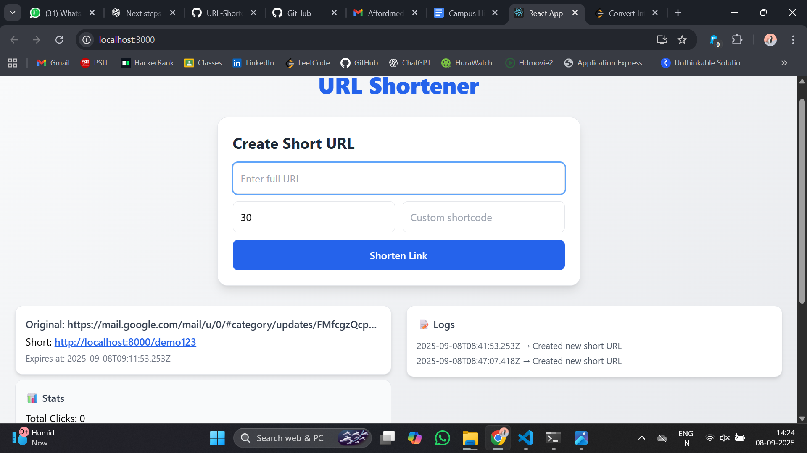
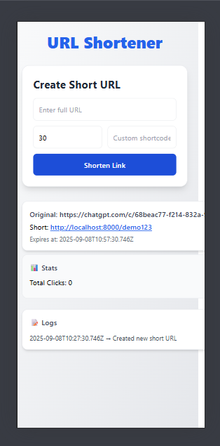

# URL Shortener

A React-based URL shortening application that allows users to create shortened URLs with custom expiry times, optional shortcodes, and detailed click analytics.

## ✨ Features

- **URL Shortening**: Convert long URLs into short, manageable links
- **Custom Shortcodes**: Assign optional custom shortcodes for personalized URLs
- **Expiry Management**: Set expiry dates for shortened URLs
- **Click Analytics**: Track click statistics with timestamps and referrer information
- **System Logging**: Monitor user actions and system events
- **Responsive Design**: Clean, modern UI built with Tailwind CSS
- **Real-time Updates**: Immediate feedback on URL creation and clicks

## 📸 Screenshots

### Desktop View


### Mobile View


## 🛠 Technology Stack

- **Frontend Framework**: React (JavaScript)
- **Styling**: Tailwind CSS
- **State Management**: React Hooks (useState)
- **Build Tool**: Create React App (CRA)
- **Testing**: React Testing Library + Jest
- **Package Manager**: npm/yarn

## 🚀 Installation

### Prerequisites

- Node.js (version 14.0 or higher)
- npm or yarn package manager

### Setup Instructions

1. **Clone the repository**
   ```bash
   git clone https://github.com/yourusername/url-shortener.git
   cd url-shortener
   ```

2. **Install dependencies**
   ```bash
   npm install
   # or
   yarn install
   ```

3. **Start the development server**
   ```bash
   npm start
   # or
   yarn start
   ```

4. **Open your browser**
   Navigate to `http://localhost:3000` to view the application.

## 📖 Usage

### Creating a Shortened URL

1. Enter the long URL you want to shorten in the input field
2. (Optional) Set an expiry date for the shortened URL
3. (Optional) Provide a custom shortcode
4. Click "Shorten URL" to generate the shortened link

### Viewing Statistics

- Click on any shortened URL card to view detailed statistics
- Statistics include click count, timestamps, and referrer information
- Real-time updates as clicks are registered

### System Logs

- Access the logs section to view all system activities
- Logs track URL creation, clicks, and other user actions
- Timestamps and action descriptions are provided for each entry

## 📁 Project Structure

```
url-shortener/
├── public/
│   ├── index.html
│   └── favicon.ico
├── screenshot/
│   ├── mobile_view.png
│   └── desktop_view.png
├── src/
│   ├── components/
│   │   ├── ShortenForm.js      # URL shortening form
│   │   ├── ShortUrlCard.js     # Individual URL display card
│   │   ├── Stats.js            # Click analytics component
│   │   └── Logs.js             # System logs component
│   └── index.js                # Application entry point
│   └── app.js                
├── package.json
└── README.md
```

## 📊 Data Models

### URL Object Structure
```javascript
{
  id: string,           // Unique identifier
  original: string,     // Original long URL
  short: string,        // Generated short URL
  expiry: date,         // Expiration date
  clicks: [             // Array of click events
    {
      timestamp: date,  // When the click occurred
      referrer: string  // Source of the click
    }
  ]
}
```

### Log Entry Structure
```javascript
{
  time: date,           // Timestamp of the action
  action: string        // Description of the action performed
}
```

## 🏗 Architecture

### High-Level Overview

The application follows a modular React architecture with clear separation of concerns:

- **App.js**: Manages global state for URLs and system logs
- **ShortenForm.js**: Handles URL input and validation
- **ShortUrlCard.js**: Displays individual shortened URLs with actions
- **Stats.js**: Provides detailed analytics and click tracking
- **Logs.js**: Shows system activity and user actions

### State Management

Currently uses React's built-in `useState` hooks for state management. The architecture is designed to easily accommodate more robust state management solutions like Redux or Zustand as the application scales.

## 🧪 Testing

Run the test suite using:

```bash
npm test
# or
yarn test
```

The testing setup includes:
- Unit tests for individual components
- Integration tests for user workflows
- React Testing Library for component testing
- Jest for test running and assertions

### Running Specific Tests

```bash
# Run tests in watch mode
npm test -- --watch

# Run tests with coverage
npm test -- --coverage
```

## 🚀 Future Enhancements

### Backend Integration
- REST API integration for data persistence
- Database storage for URLs and analytics
- User authentication and authorization

### Advanced Features
- QR code generation for shortened URLs
- Bulk URL shortening
- Advanced analytics dashboard
- Custom domain support
- API rate limiting

### Performance Optimizations
- Pagination for large datasets
- Virtual scrolling for logs and statistics
- Caching mechanisms
- Code splitting and lazy loading

### Security Enhancements
- Input sanitization and validation
- CSRF protection
- Rate limiting for URL creation
- Malicious URL detection

## 🤝 Contributing

We welcome contributions! Please follow these steps:

1. Fork the repository
2. Create a feature branch (`git checkout -b feature/amazing-feature`)
3. Commit your changes (`git commit -m 'Add some amazing feature'`)
4. Push to the branch (`git push origin feature/amazing-feature`)
5. Open a Pull Request

### Development Guidelines

- Follow the existing code style and conventions
- Write tests for new features
- Update documentation as needed
- Ensure all tests pass before submitting

